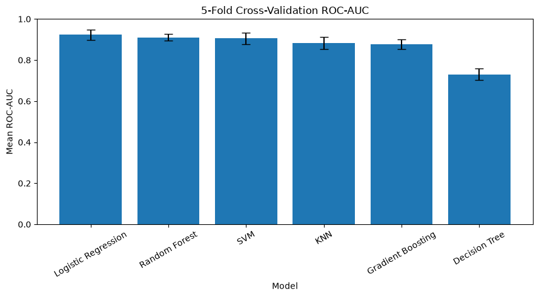
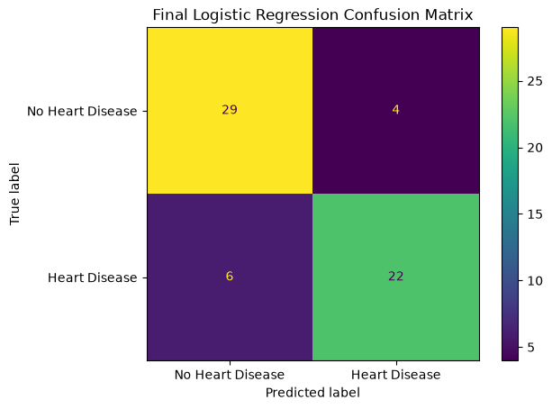
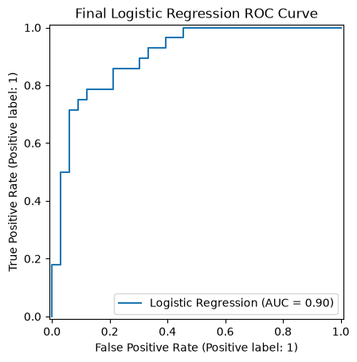
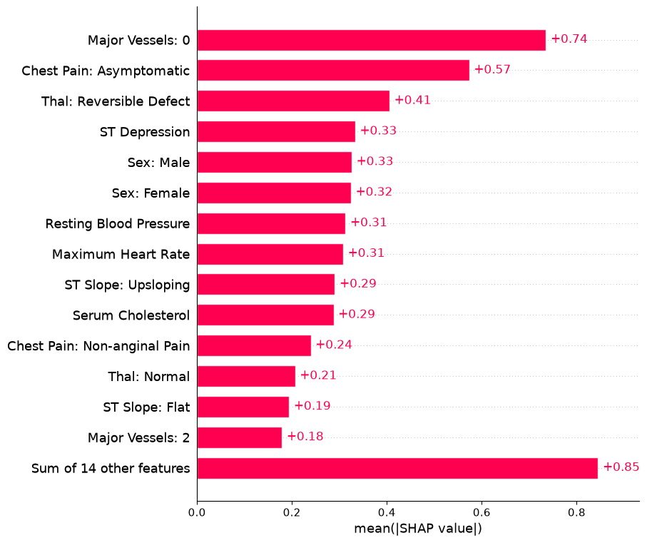
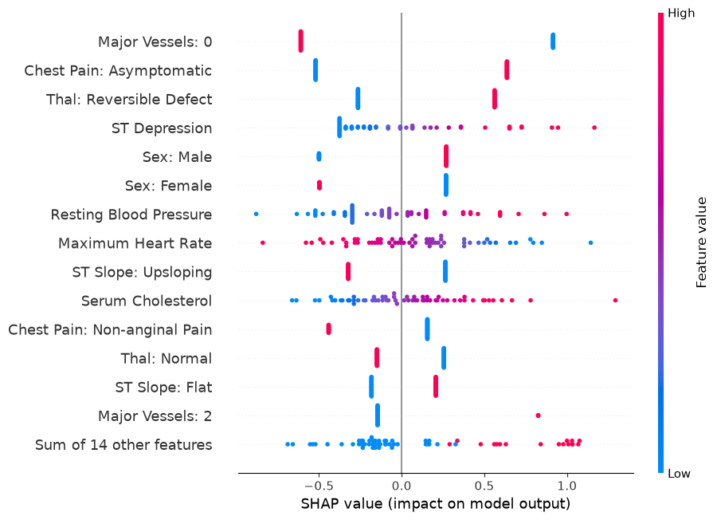
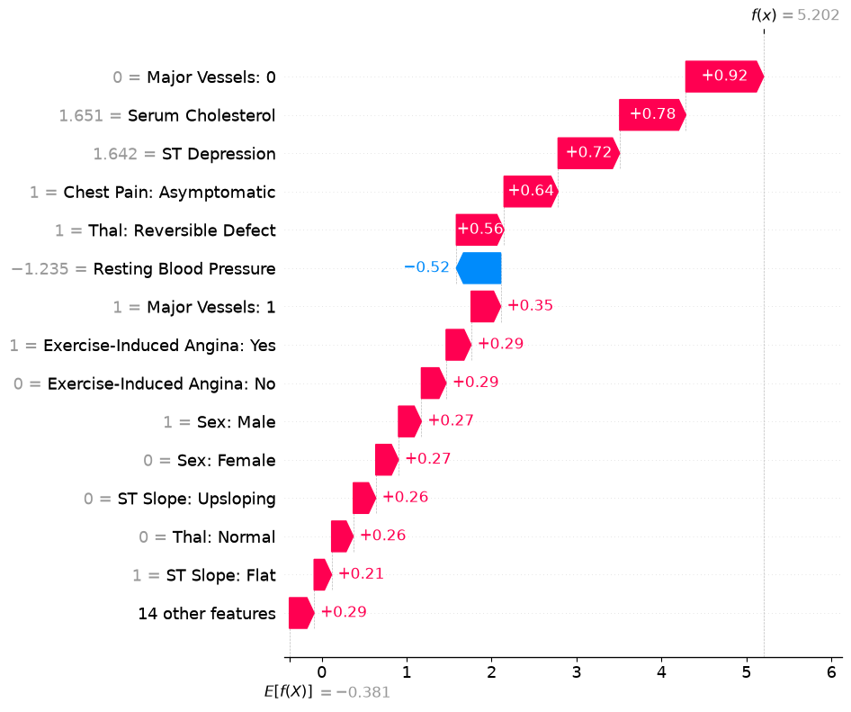

# Heart Disease Risk Prediction with Explainable AI

A machine learning portfolio project for predicting the **presence of heart disease** from clinical features using the UCI Cleveland Heart Disease dataset. The project covers exploratory data analysis, leakage-safe preprocessing, model comparison, stratified cross-validation, hyperparameter tuning, final holdout evaluation, and SHAP-based explainability.

> **Important:** This project is educational and intended for machine learning research/portfolio use. It is **not a clinical diagnostic system** and should not be used for medical decision-making.

## Project Overview

- **Task:** Binary classification
- **Target:** `0 = No Heart Disease`, `1 = Heart Disease`
- **Dataset:** UCI Cleveland Heart Disease
- **Samples:** 303
- **Original input features:** 13
- **Features after preprocessing:** 28
- **Train / test split:** 242 / 61
- **Cross-validation:** 5-fold StratifiedKFold with shuffling
- **Primary model-selection metric:** ROC-AUC
- **Final model:** Logistic Regression

Dataset source: https://archive.ics.uci.edu/dataset/45/heart+disease

## Workflow

1. Data loading and initial inspection
2. Data quality checks and missing-value handling
3. Binary target transformation
4. Exploratory data analysis
5. Stratified train/test split
6. Numerical preprocessing: median imputation + standardization
7. Categorical preprocessing: most-frequent imputation + one-hot encoding
8. Baseline Logistic Regression
9. Comparison of six classifiers
10. 5-fold stratified cross-validation
11. Hyperparameter tuning with GridSearchCV
12. Final holdout evaluation
13. Explainable AI with SHAP

## Models Compared

- Logistic Regression
- K-Nearest Neighbors
- Support Vector Machine
- Decision Tree
- Random Forest
- Gradient Boosting

## Cross-Validation Results

| Model | Accuracy | Precision | Recall | F1 | Mean ROC-AUC | ROC-AUC Std |
|---|---:|---:|---:|---:|---:|---:|
| Logistic Regression | 0.8429 | 0.8413 | 0.8202 | 0.8284 | **0.9230** | 0.0258 |
| Random Forest | 0.8223 | 0.8218 | 0.7846 | 0.8014 | 0.9102 | **0.0170** |
| SVM | **0.8513** | **0.8597** | 0.8115 | **0.8335** | 0.9052 | 0.0273 |
| KNN | 0.8141 | 0.8479 | 0.7300 | 0.7830 | 0.8838 | 0.0296 |
| Gradient Boosting | 0.7894 | 0.7948 | 0.7304 | 0.7605 | 0.8769 | 0.0241 |
| Decision Tree | 0.7314 | 0.7060 | 0.7123 | 0.7076 | 0.7302 | 0.0283 |



## Hyperparameter Tuning

### Logistic Regression

Best parameter:

```text
C = 1
```

Best 5-fold CV ROC-AUC: **0.9230**

### Random Forest

Best parameters:

```text
max_depth = 5
min_samples_leaf = 1
min_samples_split = 2
n_estimators = 100
```

Best 5-fold CV ROC-AUC: **0.9152**

### SVM

Best parameters:

```text
C = 1
kernel = rbf
gamma = auto
```

Best 5-fold CV ROC-AUC: **0.9174**

The tuned Logistic Regression model produced the highest cross-validation ROC-AUC among the tuned candidates and was selected as the final model. It also offers straightforward interpretation for the explainability stage.

## Final Holdout Test Performance

| Metric | Score |
|---|---:|
| Accuracy | **0.8361** |
| Precision | **0.8462** |
| Recall | **0.7857** |
| F1-score | **0.8148** |
| ROC-AUC | **0.9015** |

### Confusion Matrix

- True Negatives: **29**
- False Positives: **4**
- False Negatives: **6**
- True Positives: **22**



### ROC Curve



## Explainable AI with SHAP

SHAP was used to explain both global model behavior and individual predictions. The global ranking below uses **mean absolute SHAP values**, so it measures contribution magnitude rather than whether a feature increases or decreases predicted heart-disease probability.

Top global SHAP features:

| Rank | Feature | Mean Absolute SHAP Value |
|---:|---|---:|
| 1 | Major Vessels: 0 | 0.7352 |
| 2 | Chest Pain: Asymptomatic | 0.5735 |
| 3 | Thal: Reversible Defect | 0.4056 |
| 4 | ST Depression | 0.3332 |
| 5 | Sex: Male | 0.3260 |
| 6 | Sex: Female | 0.3243 |
| 7 | Resting Blood Pressure | 0.3132 |
| 8 | Maximum Heart Rate | 0.3080 |
| 9 | ST Slope: Upsloping | 0.2906 |
| 10 | Serum Cholesterol | 0.2877 |

### Global SHAP Importance



### SHAP Beeswarm



### Individual Prediction Explanation

For one positive test prediction, the model estimated a heart-disease probability of **0.9945**. The waterfall plot shows how individual features moved the model output away from its baseline prediction.



## Model Selection Note

Model selection was based primarily on **5-fold stratified cross-validation**. The holdout test set was then used to report final predictive performance. Because the dataset is small, cross-validation results are emphasized when comparing candidate models.


## Limitations

- The Cleveland dataset contains only 303 samples, so performance estimates have substantial sampling uncertainty.
- The results come from one historical dataset and should not be assumed to generalize to current clinical populations without external validation.
- SHAP explanations describe the fitted model's behavior; they do not establish clinical causality.
- Predicted probabilities from this project should not be interpreted as validated clinical risk scores.

## Repository Structure

```text
heart-disease-xai/
├── notebook/
│   └── Heart_Disease_Risk_Prediction_XAI.ipynb
├── images/
│   ├── confusion_matrix.png
│   ├── cross_validation_roc_auc.png
│   ├── model_comparison_roc_auc.png
│   ├── roc_curve.png
│   ├── shap_beeswarm.png
│   ├── shap_global_importance.png
│   └── shap_waterfall.png
├── .gitignore
├── README.md
└── requirements.txt
```

## Environment

The notebook was run with the following main package versions:

- Python 3.14.7
- NumPy 2.5.3
- pandas 3.0.6
- SciPy 1.18.1
- scikit-learn 1.9.1
- Matplotlib 3.11.2
- SHAP 0.52.0

## How to Run

```bash
conda create -n heart-disease-xai python=3.14
conda activate heart-disease-xai
pip install -r requirements.txt
jupyter lab
```

Then open:

```text
notebook/Heart_Disease_Risk_Prediction_XAI.ipynb
```

## References

- UCI Machine Learning Repository — Heart Disease: https://archive.ics.uci.edu/dataset/45/heart+disease
- scikit-learn documentation: https://scikit-learn.org/stable/
- SHAP documentation: https://shap.readthedocs.io/
